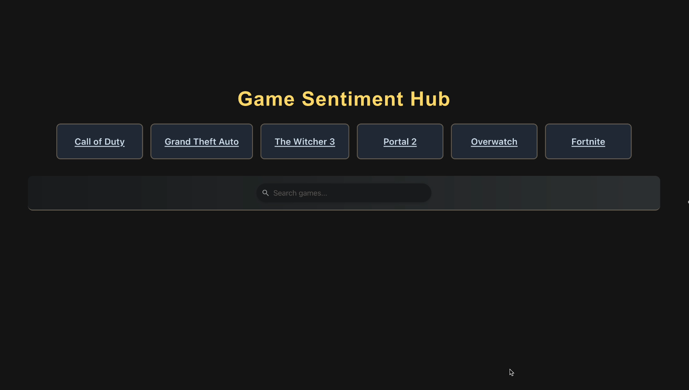
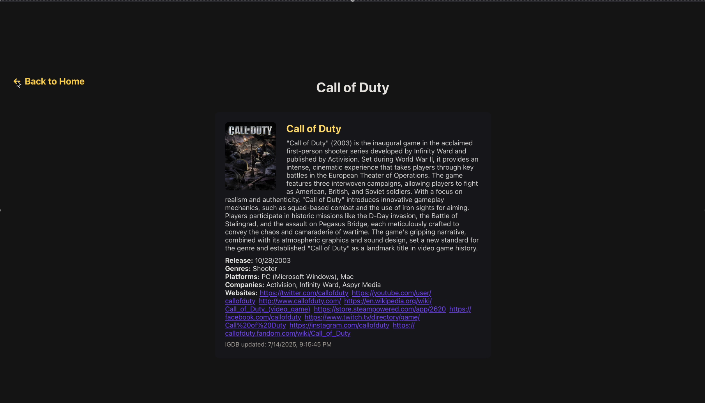
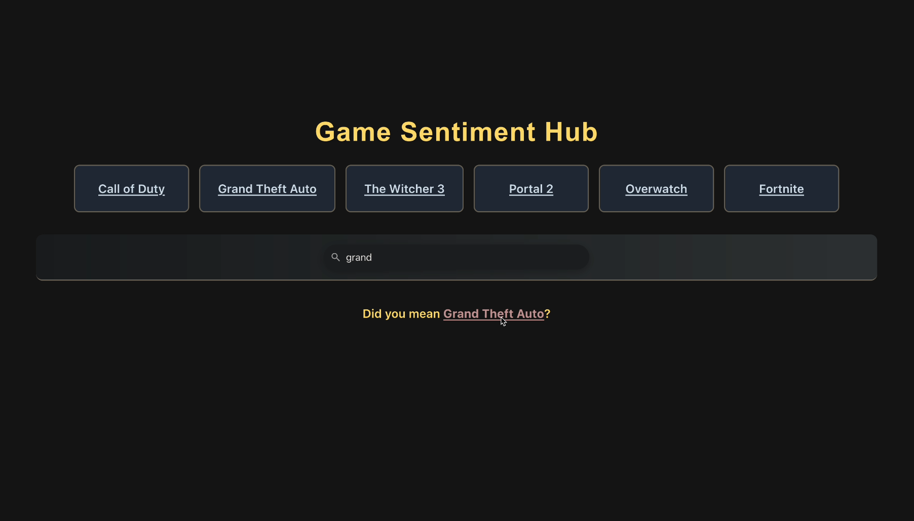
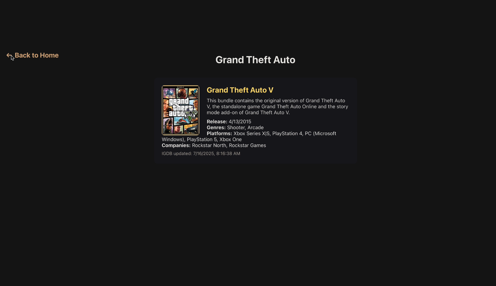
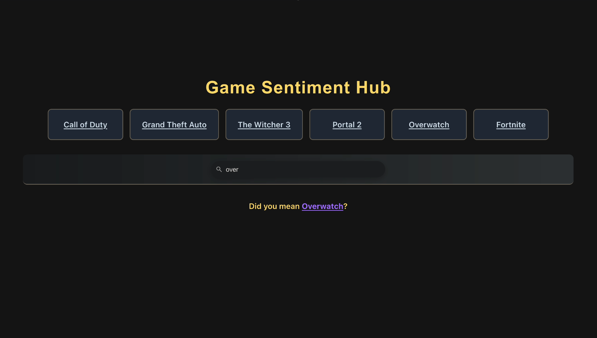
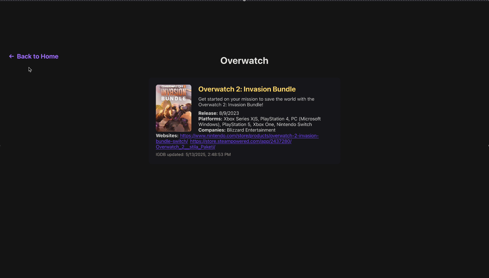
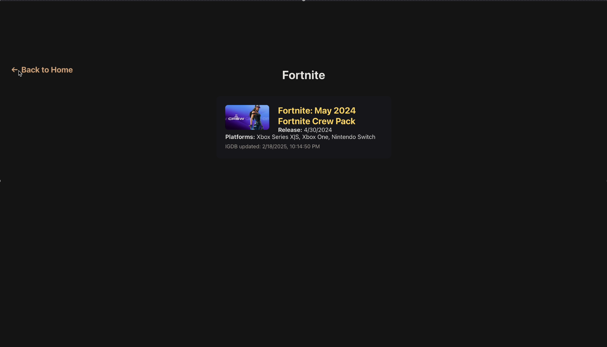

<b>Webpage Deliverables & Testing</b>

  

  

  

  

  

  

  

<b>Tests:</b>
     
plain code without markdown formatting can be found in /3308-Project/frontend/sentiment_app/src/App.test.js  

import React from 'react';  
import { render, screen, fireEvent } from '@testing-library/react';  
import '@testing-library/jest-dom'; 
import userEvent from '@testing-library/user-event'; 
import App from './App'; 

// tests that the page is loadable and contains a title 
test('Any: render a page with title', () => { 
  render(<App />); 

    const headings = screen.getAllByRole('heading');
    const h1 = headings.find(h => h.tagName === 'H2');
    expect(h1).toBeInTheDocument();
}); 

// tests that the page contains a search bar  
test('Any: render search bar', () => { 
  render(<App />); 

  const searchBar = screen.getByPlaceholderText(/Search games\.\.\./i); 
  expect(searchBar).toBeInTheDocument(); 
}); 

// test that the home page contains 6 linked tiles 
// if we add more links to the home page we can change the expected length  
test('Home: page contains 6 tile links', () => { 
  render(<App />); 

  const links = screen.getAllByRole('link'); 
  expect(links).toHaveLength(6); 
}); 

// test that links have valid contents 
test('Any: check link validity', () => { 
  render(<App />); 
  
  const links = screen.getAllByRole('link'); 
  links.forEach(link => { 
    const href = link.getAttribute('href'); 
    expect(href).toBeTruthy(); 
    // matches "/" for relative path, "http://"" or "https://"" 
    expect(href).toMatch(/^(\/|https?\/\/)/) 
  }) 
}); 

//test you can type into the search bar  
test('Any: search bar updates', async () => { 
  render(<App />); 

  const input = screen.getByPlaceholderText(/Search games\.\.\./i); 
  await userEvent.type(input, 'testing'); 
  expect(input).toHaveValue('testing'); 
}); 
